# Saola-1R build instructions

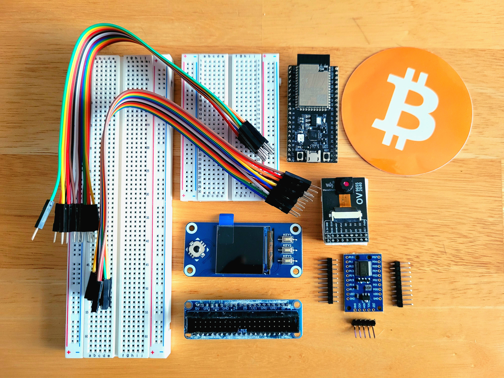

Components:
* [esp32-S2-Saola-1R](https://www.digikey.com/en/products/detail/espressif-systems/ESP32-S2-SAOLA-1R/11613138)
* [Waveshare 1.3" LCD hat](https://www.waveshare.com/1.3inch-lcd-hat.htm)
* [40-pin gpio adapter](https://www.aliexpress.com/item/2255799953360126.html)
* [Waveshare OV2640 camera board](https://www.waveshare.com/ov2640-camera-board.htm)
* [15x male-to-male 20cm jumper cables](https://a.co/3TyH0lP)
* [16x male-to-female 20cm jumper cables](https://a.co/3TyH0lP)
* [Full-size (830-pin) breadboard](https://a.co/iDaFcTl)
* [Half-size (400-pin) breadboard](https://a.co/9UXsIVi)

_Note: TABConf attendees also received a 16-channel gpio expander module, but we don't currently need the additional gpios_

---

## General wiring note
Solderless breadboards are nice for quick prototyping but their internal grip mechanism in each slot can quickly get loose. If possible, plug in a component or jumper wire and leave it there; continuous re-seating will make the slot too loose and start causing intermittent failures.

---

## Placing the Saola-1R
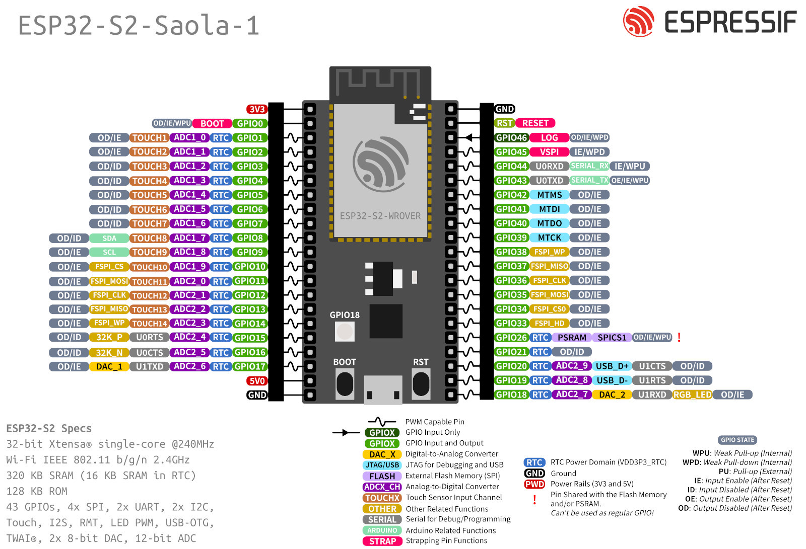

The dev board has an annoyingly wide stance so it will not fit on a single breadboard. Notice how there are no accessible pin slots outside of the far legs:

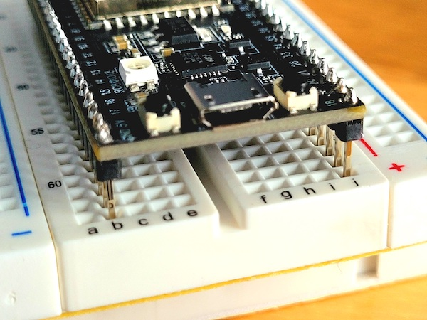

So our only recourse is to force it to span two breadboards. It's a tight fit but you can create enough torque to make the pins seat. 

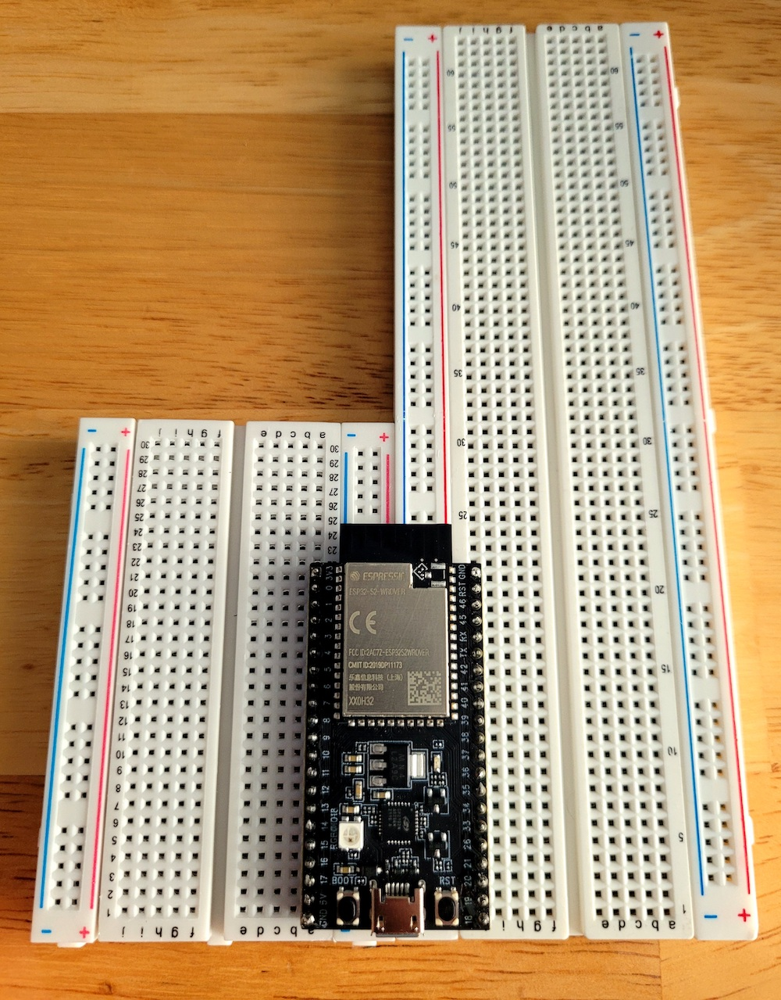

_Note: breadboards usually have interlocking side tabs. Make sure those are pointing out so that they don't create any additional gaps between the two breadboards._

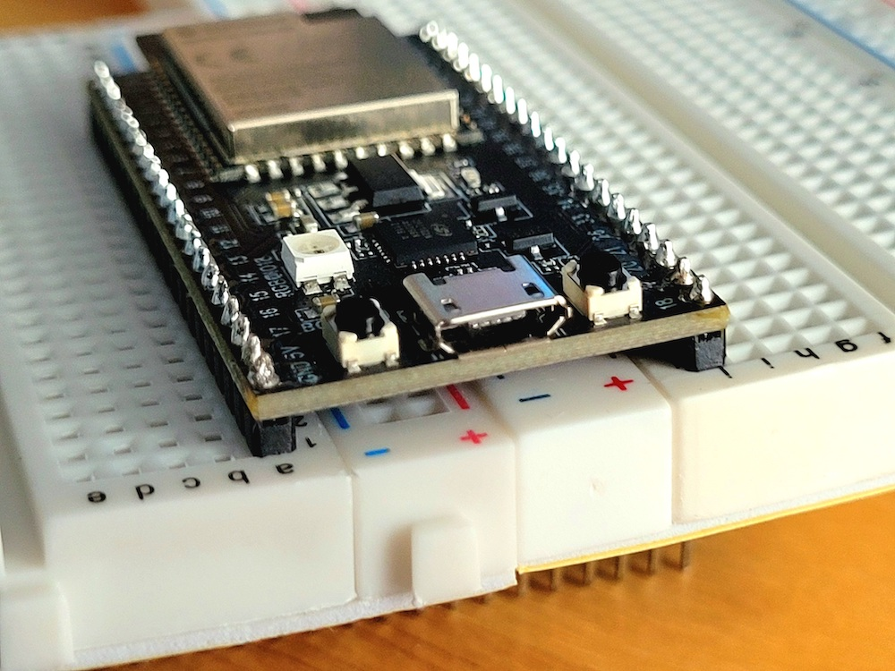

---

## Place the 40-pin gpio adapter
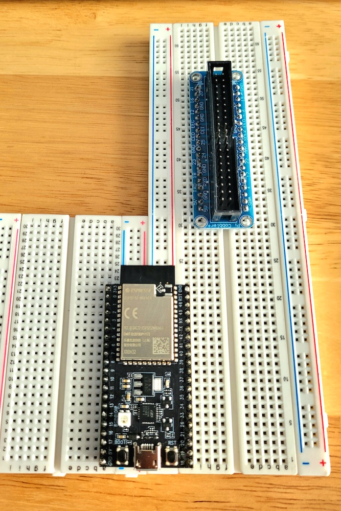

Pay attention to the orientation! The corner pins should be:

```
21 - GND
|     |
|     |
|     |
|     |
|     |
5V - 3V3
```

Also note that we want it biased one column to the left:

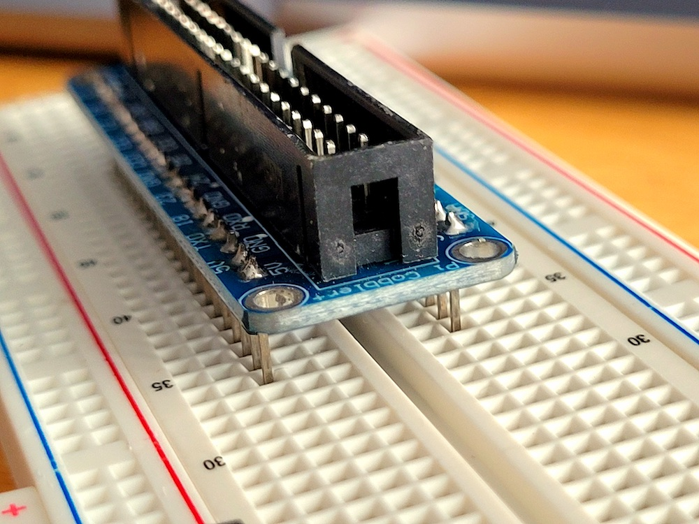

The adapters might have some fabrication gunk that obscures the pin labels:

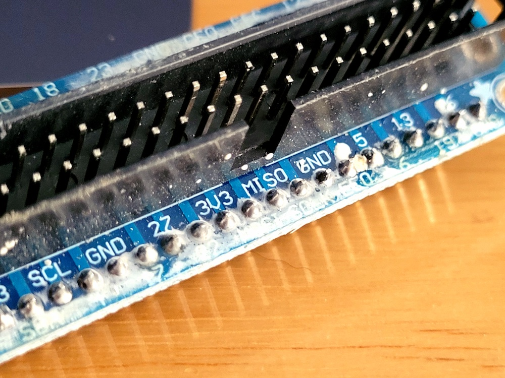

Wiping it with rubbing alcohol cleans it up:

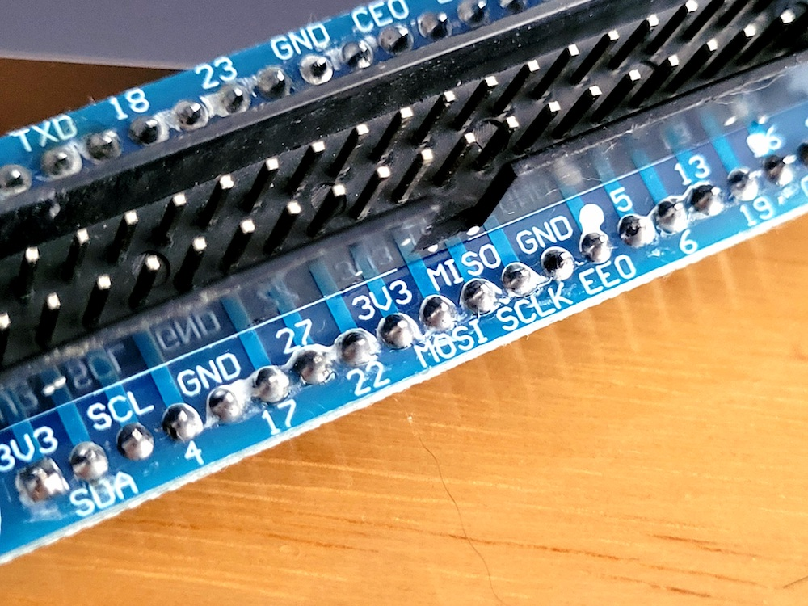

---

## Wiring the ST7789 display
The ST7789 display is integrated into the Waveshare LCD hat. The hat will sit on the 40-pin gpio adapter that we just mounted.

The gpio adapter labels the hat's Raspberry Pi 40-pin connector. So we need to connect the raspi labeled pins to their Saola destination (in other words, you can ignore the "ST7789" column of this chart):
```
ST7789      RASPI GPIO      SAOLA
---------------------------------
3.3V        3V3             3V3
GND         GND             GND
SCLK        11/SCLK         12 (FSPI_CLK)
MOSI        10/MOSI         11 (FSPI_MOSI)
CS          8/CE0           10 (FSPI_CS)
DC          25               1
RST         27               2
BL          24              (not connected)
```

The jumper cables come attached to one another. For cleanliness, keep groups attached whenever possible.

Start with a pair of attached jumpers for 3V3 and GND. Both are on the right side of the gpio adapter. Use the farthest right column of available pin slots.

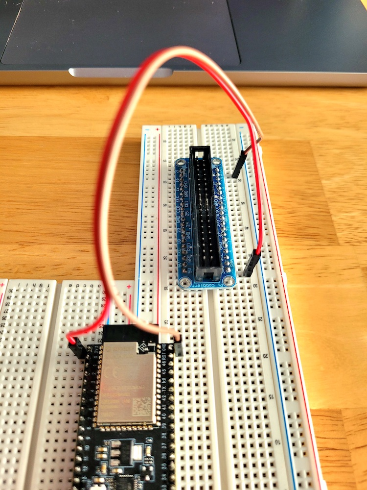

Now using a group of five jumpers, connect the Saola's pins 1-2, 10-12 to their respective pairs on the gpio adapter. Already starting to get messy:

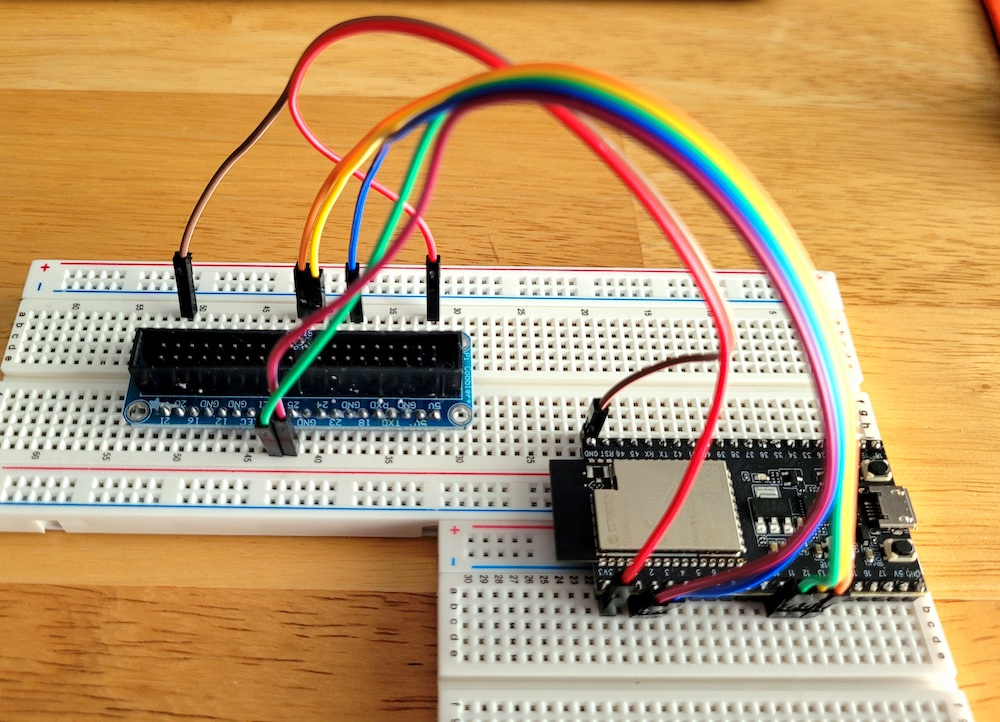


### Test the display

Seat the LCD hat to test your work. Important notes:
* Note the orientation!
* Carefully align the LCD hat on the gpio adapter's pins; the plastic socket is oversized and you can end up misaligned by one.
* Do NOT press on the LCD hat's glass screen! The glass may not break but the screen LCDs beneath it are somewhat fragile (ask me how I know)
* The right-side jumpers will get a little smashed. This is why we opted for the furthest out column of slots.

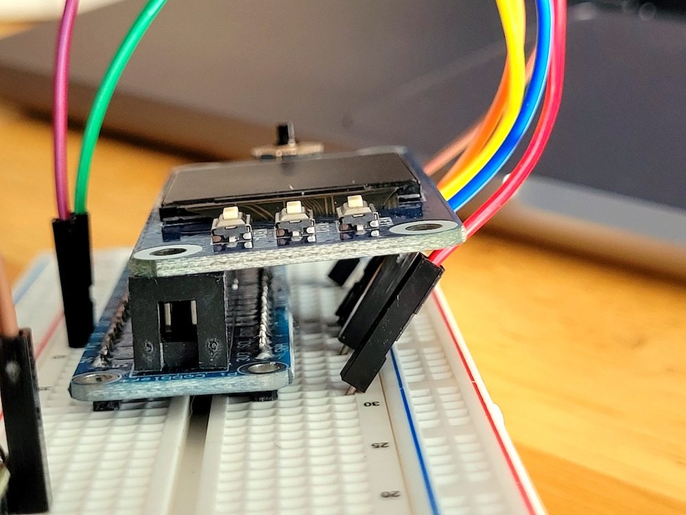

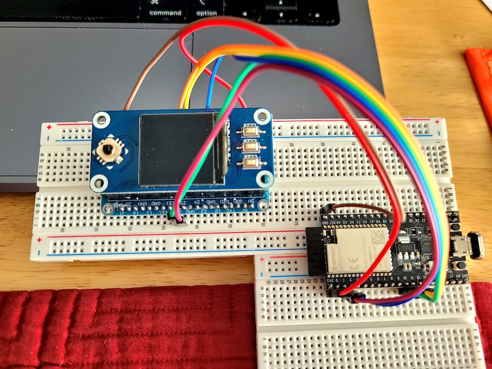

If you haven't already, write the custom Saola-1R firmware to the board. see: [instructions](/README.md#write-the-firmware-to-the-board)

Also copy over the `/demo/fonts` to the root. see: [instructions](/README.md#interact-with-the-board)

Then try running the `/demo/seedsigner_ui.py` test:
```bash
mpremote connect /dev/tty.usbserial-1110 run demos/seedsigner_ui.py
```

You should see a work-in-progress mockup of the SeedSigner UI that autoscrolls the selected button until it reaches the end of the list.

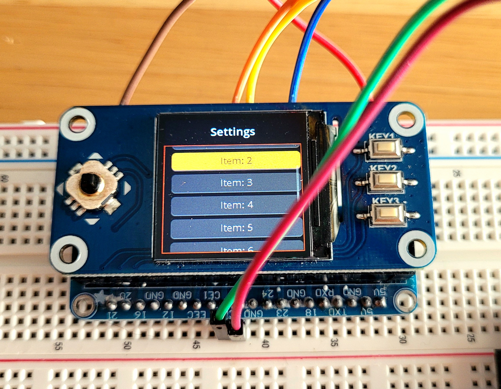

You'll need to hit the RST button on the Saola-1R or power cycle it between each script that initializes the display.

---

## Wiring the joystick and buttons
Carefully remove the LCD hat and leave its wiring in place.

The joystick requires five connections (for: up, down, left, right, and center press). The three side buttons require one jumper wire each.

```
BUTTON          RASPI GPIO      SAOLA
-------------------------------------
joystick up      6              13
joystick down   19              14
joystick left    5              15
joystick right  26              16
joystick press  13              17
key 1           21               3
key 2           20              34
key 3           16              33
```

The Saola pins have been grouped together as much as possible.

Keep five jumper wires connected together for the joystick and plug them into the Saola's 13-17. Then connect to its matching pin on the gpio adapter (e.g. Saola pin 13 goes to gpio adapter pin 6). They'll all end up grouped next to each other on the upper-right side of the gpio adapter.

Use three final jumper wires to connect the Saola pins 3, 33-34 to the gpio adapter. They'll be grouped on the upper-left side of the gpio adapter.

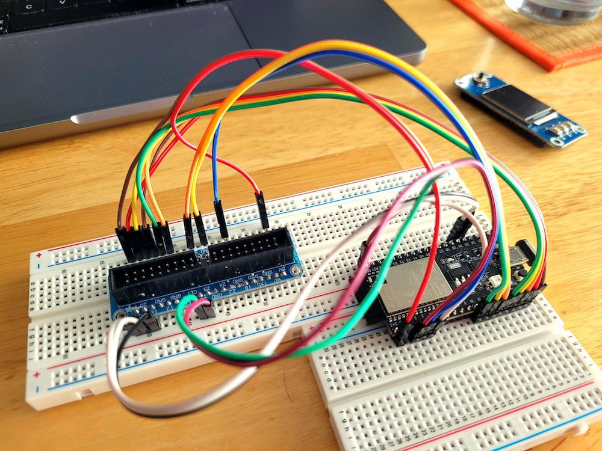

Try running `/demo/button_test.py`:
```bash
mpremote connect /dev/tty.usbserial-1110 run demos/button_test.py
```

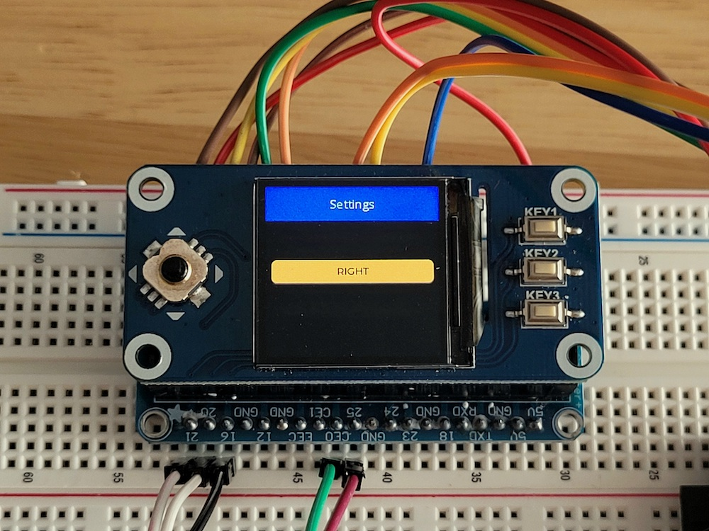

The orange center button should update its label based on the input it receives. Try up, down, left, right, center press, and Key1, Key2, Key3.